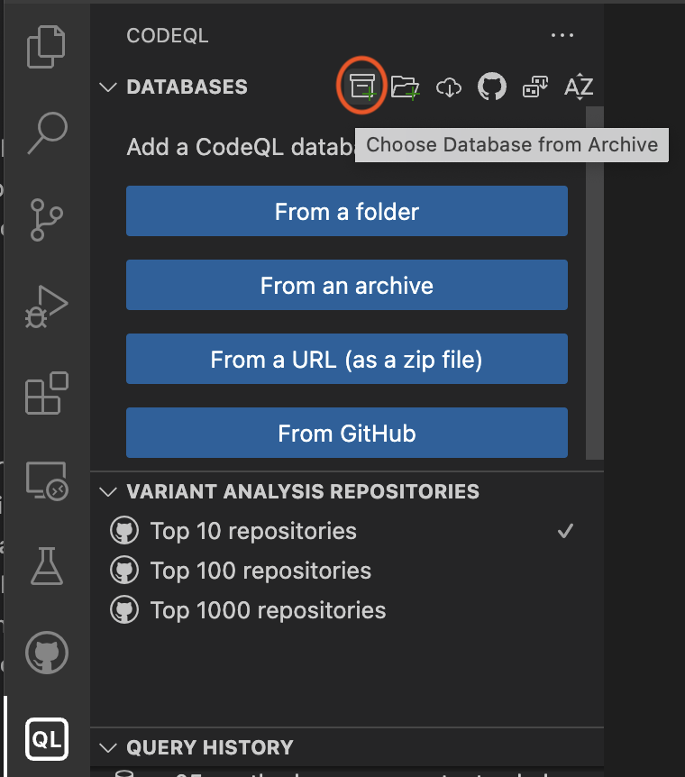
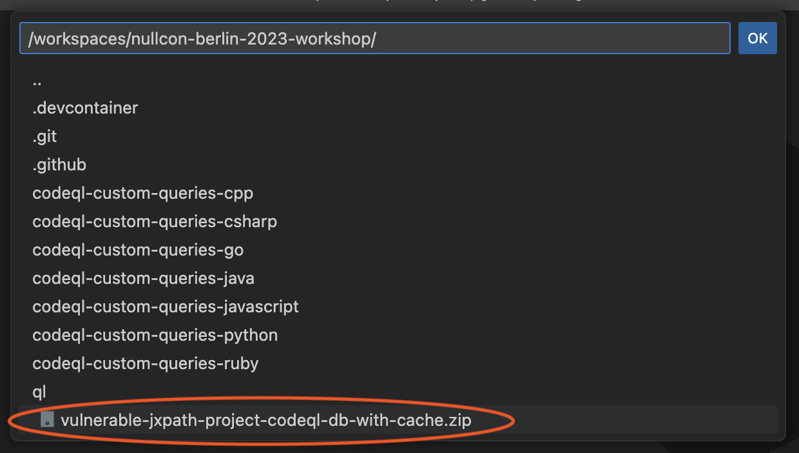
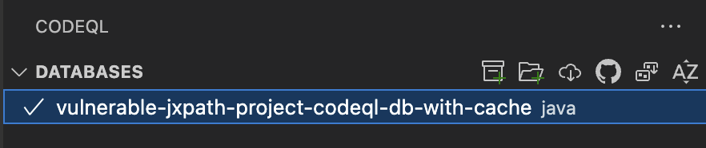

# NullCon Berlin - CodeQL Workshop Setup Instructions

 **Please follow these instructions to the end** (including the Select CodeQL Database and Test your installation section) before the workshop starts.

You can choose between two options to run the workshop exercises:
* Option A: GitHub Codespace (CodeQL is run remotely on a Linux based GitHub Codespace)
* Option B: Local installation

## Option A: GitHub Codespace

Use remote GitHub Codespaces to run the workshop exercises.

### Prerequisites

* A stable internet connection throughout the workshop.
* A GitHub account
* [Visual Studio Code](https://code.visualstudio.com/download) (VS Code) installed on your local machine.
* The [GitHub Codespaces](https://marketplace.visualstudio.com/items?itemName=GitHub.codespaces) extension for VS Code.

Note: The first 120h hours per core of Codespace usage are free per month, we use a codespace with 4 cores for this workshop since 4 cores is the current maximum for free accounts. (If you have a Pro account we recommend to switch to an 8 core machine.)

### Step-by-Step

1. Login to your [GitHub](https://github.com/login) account
2. Go to the repo https://github.com/p-/nullcon-berlin-2023-workshop / (short link: https://gh.io/nc-2023-ws)
3. Click on Code -> CodeSpaces
4. Click on the plus sign (+) to create a new codespace.

=> VS Code will start and a remote Codespace will be built (this may take some time).

## Option B: Local installation

Use a local CodeQL installation to run the workshop exercises.

### Prerequisites

* Requires to download up to 1 GB of data.
* [Visual Studio Code](https://code.visualstudio.com/download) (VS Code) and `git` installed on your local machine.

### Step-by-Step

1. Install [VS Code extension for CodeQL](https://marketplace.visualstudio.com/items?itemName=GitHub.vscode-codeql)
2. In the terminal, in a directory specified by you: `$ git clone https://github.com/p-/nullcon-berlin-2023-workshop.git`
3. `$ cd nullcon-berlin-2023-workshop`
4. `$ git submodule init`
5. `$ git submodule update --recursive`
6. In VS Code: File -> **Open Workspace** `vscode-codeql-starter.code-workspace`

=> VS Code will start and the CodeQL CLI (binaries) will be installed. (approx. 500 MB of addtional data need to be downloaded))

## Select CodeQL Database

1. Make sure you have the workspace `vscode-codeql-starter.code-workspace` open in VS Code.
2. Go To the CodeQL View
3. Click on "Choose Database from Archive" and select the `vulnerable-jxpath-project-codeql-db-with-cache.zip` file in the root of the repository.

## Test your installation

### Prerequisites

Make sure that the previously installed CodeQL database is selected in the CodeQL view. (Click on "Select" if it's not)

=> When the database is selected it should look like this (note the checkmark):

### Step-by-Step

1. In VS Code: go to the workspace folder: `codeql-custom-queries-java`
2. Create a new file `test.ql`
3. add the following content: `select "Hello World!"`
4. Save file and right click in file on "CodeQL: Run Query on Selected Database"

=>  The output should look like this:

