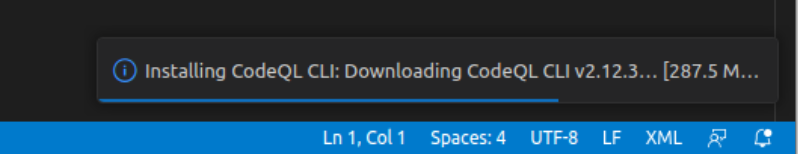
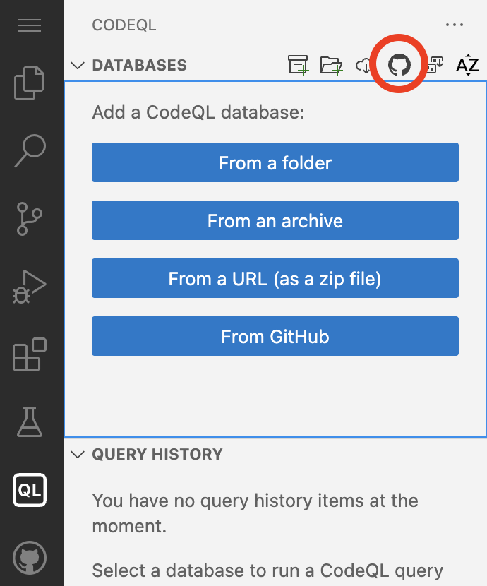
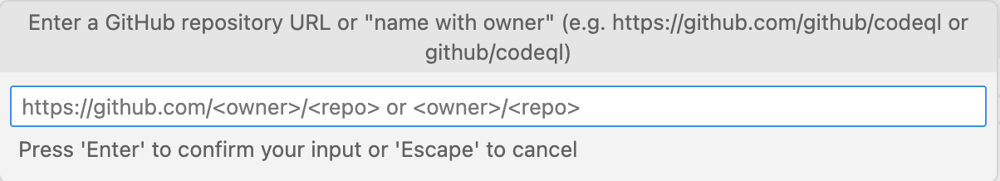
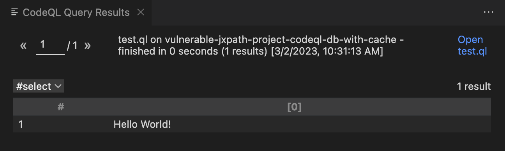

# CodeQL in a codespace

This repository contains premade workspace for trying out CodeQL, made by 
Peter Stöckli (@p-) and adapted to the exercises in the CodeQL zero to hero series. 

 **Please follow these instructions to the end** (including the [Select CodeQL Database](#select-codeql-database) and [Test your installation](#test-your-installation) sections).

You can choose between several options to do the exercises:
* Option A: Recommended: GitHub Codespace (Using a Browser or VS Code - CodeQL is run remotely on a Linux based GitHub Codespace in the cloud)
* Option B: Local installation
* CodeQL CLI
* CodeQL in [neovim](https://github.com/pwntester/codeql.nvim)
* CodeQL in [emacs](https://github.com/anticomputer/emacs-codeql) 

You can choose between two options to run the workshop exercises:
* [Option A: GitHub Codespace](#option-a-github-codespace) (Using a Browser or VS Code - CodeQL is run remotely on a Linux based GitHub Codespace in the cloud)
* [Option B: Local installation](#option-b-local-installation) (Using VS Code - CodeQL is run locally on your machine)

## GitHub Codespace

Use a remote GitHub Codespace to work on the exercises.

### Prerequisites

* GitHub account ([sign up](https://github.com/) for free)
* Browser or [Visual Studio Code](https://code.visualstudio.com/download) (VS Code) with the [GitHub Codespaces](https://marketplace.visualstudio.com/items?itemName=GitHub.codespaces) extension installed on your local machine.

Note: The first 120h hours per core of Codespace usage are free per month, we use a codespace with 4 cores for this workshop since 4 cores is the current maximum for free accounts. (If you have a Pro account, we recommend switching to an 8-core machine.)

### Step-by-Step

1. Login to your [GitHub](https://github.com/login) account
2. Go to the repo https://github.com/sylwia-budzynska/vscode-codeql-starter-codespace
3. Click on Code -> Codespaces
4. Click on the plus sign (+) to create a new codespace.

=> VS Code will start in your browser and a remote Codespace will be built (this may take some time).
If you are asked to open the workspace `vscode-codeql-starter.code-workspace` click on "Open Workspace".

5. Continue with [Selecting a CodeQL Database](#select-codeql-database)
6. Then [Test your installation](#test-your-installation)

## Option B: Local installation

Use a local CodeQL installation to work on the exercises.

### Prerequisites

* Requires downloading up to 2 GB of data in total.
* [Visual Studio Code](https://code.visualstudio.com/download) (VS Code) and `git` installed on your local machine.

### Step-by-Step

1. Install [VS Code extension for CodeQL](https://marketplace.visualstudio.com/items?itemName=GitHub.vscode-codeql)
2. In the terminal, in a directory specified by you: `$ git clone https://github.com/p-/nullcon-berlin-2023-workshop.git`
3. `$ cd nullcon-berlin-2023-workshop`
4. `$ git submodule init`
5. `$ git submodule update --recursive`
6. In VS Code: File -> **Open Workspace from File...** `vscode-codeql-starter.code-workspace`

=> VS Code will start and the CodeQL CLI (binaries) will be installed. (approx. 500 MB of additional data need to be downloaded))

7. Continue with [Selecting a CodeQL Database](#select-codeql-database)
8. Then [Test your installation](#test-your-installation)

### Troubleshooting the local installation

In case you see errors such as:
* `Failed to run query: Could not resolve library path for [..]`
* `Could not resolve module [..]` 
* `Could not resolve type [..]`

=> It is very likely that you missed cloning the git submodules (namely the ql repo). To fix this follow the [Step-by-Step](#step-by-step-1) instructions starting with step 3.

## Select CodeQL Database

1. Make sure you have the workspace `vscode-codeql-starter.code-workspace` open in VS Code.
2. Go To the CodeQL View
3. Click on choose the “Download database from GitHub” option, the one with the GitHub logo (Fun fact! Did you know that the character in the logo is called Monalisa? Now you know!). This option allows you to specify any public repo on GitHub to download as a CodeQL database - as long as it uses one of the supported languages by CodeQL. Write `sylwia-budzynska/codeql-zero-to-hero`.

Now you can test your installation:

## Test your installation

### Prerequisites

Make sure that the previously chosen CodeQL database is selected in the CodeQL view. (Click on "Select" if it's not)

### Step-by-Step

1. In VS Code: go to the workspace folder: `codeql-custom-queries-python`
2. Create a new file `test.ql`
3. add the following content: `select "Hello World!"`
4. Save file and right click in file on "CodeQL: Run Query on Selected Database"

=>  The output should look like this:

